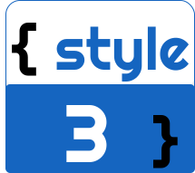

<h1 align="center">
    
</h1>

<h1 align="center">API REST de Gerenciamento de Produtos</h1>

Desenvolvendo um sistema para gerenciar produtos de uma empresa através de uma API REST, utilizando Spring Boot.

<h1 align="center">
    
</h1>

<h2 align="center">📇Guia</h2>

    •
    <a href="#checklist">Checklist</a> •
    <a href="#tecnologias">Tecnologias</a> •
    <a href="#aprendizado">Principal aprendizado</a> • 
    <a href="#dificuldades">Dificuldades</a> •
    <a href="#links">Links</a> •
    <a href="#autor">Autor</a>

<h4 align="center">🔨 A API está em fase de testes 🔨</h4>

<h1 id="checklist">🗹 Checklist</h1>

- [x] Criação inicial do projeto utilizando Spring Initialzr (https://start.spring.io/).
- [x] Criação de modelos de dados para o mapeamento de entidades em banco de dados (Produto, Tipos de Produto).
- [x] Desenvolvimento das operações de gerenciamento de produtos (Cadastro, Leitura, Atualização e Remoção de produtos do sistema).
- [x] Relacionando o as operações de gerenciamento de produtos com o padrão de arquitetura REST.
- [ ] Desenvolvimento de testes unitários para validação das operações de gerenciamento.
- [ ] Gerando documentação do sistema em Swagger.
- [ ] Subindo o sistema na plataforma de nuvem Heroku.

<h1 id="tecnologias">⌨️Tecnologias</h1>

* Java 11 ou versões superiores.
* Maven 3.6.3 ou versões superiores.
* SpringFox Swagger 2.9.2 ou versões superiores para gerar documentação de APIs JSON feitas com Spring.
* Projeto Lombok.
* IDE favorita do desenvolvedor.
* Controle de versionamento GIT instalado.
* Conta no GitHub para armazenamento do projeto em nuvem.
* Conta no Heroku para o deploy do projeto na nuvem
* Muita vontade de aprender e garra:)

<h1 id="tecnologias">✨Principais aprendizados</h1>

* Criação de exceções personalizadas a partir da captura de eventos REST 
* Mapeamento e geração de documentação em Swagger com SpringFox.

<h1 id="tecnologias">🚧Dificuldades</h1>

* Desenvolvimento de Testes Unitários para validar as operações de gerenciamento de produtos.

<h1 id="links">🔗Links relacionados</h1>

* [Site oficial do Spring](https://spring.io/)
* [Site oficial do Spring Initialzr, para setup do projeto](https://start.spring.io/)
* [Site oficial do Heroku](https://www.heroku.com/)
* [Site oficial do GIT](https://git-scm.com/)
* [Site oficial do GitHub](http://github.com/)
* [Documentação oficial do Lombok](https://projectlombok.org/)
* [Referência para o padrão arquitetural REST](https://restfulapi.net/)
* [Site do SpringFox para gerar documentação em Swagger](https://springfox.github.io/springfox/)

<h1 id="autor">👨‍💻Autor</h1>

<h2>Jayneanderson Santos</h2>

Aceita um café? Me mande uma mensagem.

 
 
